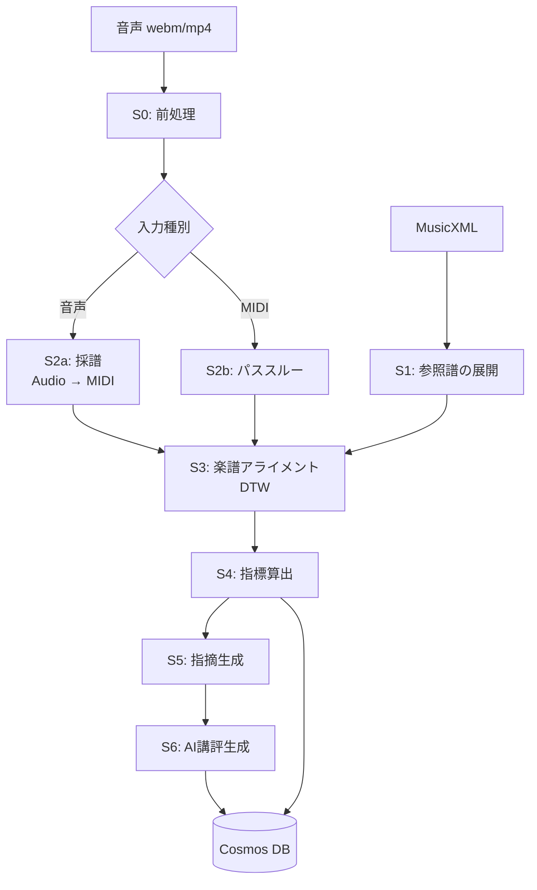

# 分析パイプライン設計 — Ledger Lines

| 項目 | 内容 |
|---|---|
| ドキュメントID | DESIGN-PIPELINE |
| バージョン | 0.2（M4 の実測を反映） |
| 最終更新 | 2026-07-25 |
| 検証 | 採譜・アライメント・指標算出は M4 で実データ検証済み → [M4レポート](../poc/m4-report.md)。AI講評と実行基盤は未検証 |

---

## 1. 全体像

音声（またはMIDI）と楽譜を入力に、指標・指摘・AI講評を出力する非同期パイプライン。



| ステージ | 名称 | 目標時間<br/>(3分の演奏) | 失敗時 |
|---|---|---|---|
| S0 | 前処理 | 3秒 | 中断 |
| S1 | 参照譜の展開 | 1秒（曲登録時に事前実行しキャッシュ） | 中断 |
| S2 | 採譜 | 25秒 | 中断 |
| S3 | 楽譜アライメント | 8秒 | 部分結果を返す |
| S4 | 指標算出 | 2秒 | 中断 |
| S5 | 指摘生成 | 1秒 | 空で継続 |
| S6 | AI講評 | 12秒 | 空で継続（後で再試行） |
| | **合計** | **約52秒** | |

**S6 の失敗は致命的でない。** 分析結果自体は S4/S5 で完成しているため、
講評なしで `completed` にし、バックグラウンドで再試行する。

---

## 2. S0: 前処理

### 2.1 処理内容

| # | 処理 | 詳細 |
|---|---|---|
| 1 | デコード | `ffmpeg` で WAV (PCM 16bit) に変換 |
| 2 | リサンプル | 16 kHz モノラル（採譜モデルの入力仕様に合わせる） |
| 3 | DC オフセット除去 | 平均値を減算 |
| 4 | 無音トリム | 先頭・末尾の無音を除去（閾値 -50 dBFS、余白 0.3秒を残す） |
| 5 | 品質チェック | 下表 |

> **注意**: 正規化（ノーマライズ）は**行わない**。ダイナミクス評価のため相対音量を保持する必要がある。
> 音量が小さすぎる場合はエラーにするか、ゲイン係数を記録したうえで適用する。

### 2.2 品質チェック

| チェック | 閾値 | 失敗時 |
|---|---|---|
| 実効音量 | RMS < -45 dBFS | `AUDIO_TOO_QUIET` |
| クリッピング率 | サンプルの 1% 超が \|x\| > 0.99 | 警告（`dynamics` を N/A に） |
| 長さ | < 3秒 または > 15分 | `INVALID_LENGTH` |
| ピアノらしさ | 後述 | `NOT_PIANO` |
| メトロノーム混入 | 後述 | 警告のみ |

**ピアノらしさの判定**: スペクトル重心の時間変化と、
オンセット後の減衰カーブ（ピアノは打鍵後に単調減衰する）から簡易判定する。
軽量な分類器で十分。厳しくしすぎると電子ピアノの音色で誤検知するため、閾値は緩めに。

**メトロノーム混入の判定**: 一定間隔（±10ms）で繰り返す短いブロードバンドのオンセットを検出。
検出時は「メトロノーム音が録音に含まれています。ヘッドホンの使用を推奨します」と警告する。
除去は行わない（除去処理で演奏音まで劣化するリスクのほうが大きい）。

### 2.3 出力

```
preprocessed.wav        16kHz mono PCM
preprocess_meta.json    { rmsDbfs, peakDbfs, clippingRate, durationSec,
                          trimOffsetSec, agcDetected, metronomeDetected }
```

`trimOffsetSec` は重要。以降のすべての時刻はトリム後を基準にするため、
元音声への再生シークには元の時間軸に戻す必要がある。

---

## 3. S1: 参照譜の展開

MusicXML を「演奏順の音符列」に変換する。**曲登録時に一度だけ実行し、結果をキャッシュする。**

### 3.1 使用ライブラリ

| 候補 | 評価 |
|---|---|
| **music21** (MIT, Python) | ◎ 第一候補。繰り返し展開 (`Expander`)、和声解析、拍子・調号の扱いが充実 |
| partitura (Apache-2.0, Python) | ○ 演奏解析向けに設計されており、note array の扱いが軽量。music21 より高速 |
| 自前パーサ | × 繰り返し・オッシアの網羅にコストがかかりすぎる |

**第一候補: music21**（繰り返し展開の堅牢さを優先）。
性能問題が出た場合は partitura への切り替えを検討する。

### 3.2 繰り返しの展開

これが最大の落とし穴（機能仕様の R7）。

| 記号 | 対応 |
|---|---|
| `|: :|` リピート | 展開する |
| 1番/2番括弧 (volta) | 展開する |
| D.C. / D.S. / Coda / Fine | 展開する |
| `segno` / `to coda` | 展開する |

展開後、各音符は以下の2つの小節番号を持つ。

| フィールド | 意味 |
|---|---|
| `measure` | **演奏順**の通し番号（1, 2, ..., N）。分析はこちらを使う |
| `scoreMeasure` | 楽譜上の小節番号。UI表示・楽譜ハイライトはこちらを使う |

繰り返しにより `scoreMeasure` は重複しうる（1回目と2回目）。
UI で楽譜にヒートマップを重ねる際は、**同じ `scoreMeasure` を持つ複数の `measure` のスコアを平均**して表示する。
分析結果の詳細では 1回目/2回目を区別して見られるようにする。

### 3.3 抽出する情報

[指標定義書 1.1節](../spec/metrics.md#11-参照譜-reference-score) の `RefNote` / `RefMeasure` を構築する。

| 情報 | 取得元 |
|---|---|
| 音高・音価・声部・譜表 | `note` 要素 |
| 累積拍 | 拍子と音価から算出 |
| 強弱記号 | `direction/dynamics`。**直前の有効な指示を各音符に伝播させる** |
| ヘアピン | `direction/wedge` の開始・終了から補間 |
| アーティキュレーション | `notations/articulations` |
| スラー | `notations/slur`。開始〜終了の音符に `slurred: true` を付与 |
| ペダル | `direction/pedal` |
| テンポ | `direction/metronome` および `sound[@tempo]` |
| テンポ文字 | `direction/words`（"rit." "rubato" 等を正規表現で抽出） |
| 和音構成 | 同一 onsetBeat の音符群を和音とみなす |

### 3.4 タイの処理

タイで繋がれた音符は**1つの音符に統合**する（onset は最初、duration は合計）。
採譜結果では打鍵は1回しか現れないため、統合しないと `missed` が大量発生する。

### 3.5 出力

```json
{
  "songId": "...",
  "expandedMeasureCount": 96,
  "scoreMeasureCount": 64,
  "notes": [ /* RefNote[] */ ],
  "measures": [ /* RefMeasure[] */ ],
  "hasDynamicMarks": true,
  "hasArticulationMarks": true,
  "hasPedalMarks": false
}
```

`hasXxxMarks` は指標の N/A 判定に使う。

---

## 4. S2a: 採譜（音声 → MIDI）

### 4.1 モデル選定

| 候補 | ライセンス | 特徴 | 評価 |
|---|---|---|---|
| **ByteDance `piano_transcription_inference`** | Apache-2.0 | 高解像度のオンセット/オフセット/velocity 回帰。**sustain pedal 検出を含む**。MAESTRO で学習 | ◎ **採用確定（M4 で実証）** |
| Spotify Basic Pitch | Apache-2.0 | 軽量・多楽器。CPU で高速 | ○ フォールバック候補。ピアノ特化ではないため精度は劣る |
| hFT-Transformer / 系列モデル | 研究実装 | Transformer ベースで SOTA 級 | △ 実装の成熟度とライセンス。M5 以降 |
| Google MT3 | Apache-2.0 | マルチトラック。ピアノ単体には過剰 | △ |

**選定理由（ByteDance）**:
1. **velocity を回帰で推定する**（ダイナミクス指標に必須）
2. **sustain pedal を専用のサブネットワークで検出する**（ペダル指標に必須）
3. Apache-2.0 で商用利用可能
4. 実績が豊富で、事前学習済みモデルが公開されている

Basic Pitch は velocity/pedal の情報が弱く、本プロダクトの差別化指標（表現の評価）を支えられない。

#### M4 での実測（MAESTRO 4曲・各90秒、CPU）

| 条件 | note F1 | onset MAE | velocity 相関 | pedal F1 |
|---|---|---|---|---|
| クリーン | 0.982 | 4.4 ms | 0.960 | 0.913 |
| 部屋の残響 + ノイズ | 0.885 | 18.1 ms | 0.926 | 0.864 |
| スマホ録音 | 0.885 | 18.0 ms | 0.924 | 0.861 |
| スマホ録音 + AGC | 0.833 | 17.9 ms | **0.713** | 0.812 |

- **ペダル検出は想定より大幅に良い**（劣化条件でも F1 0.81 以上）→ ペダル指標を MVP に採用
- **AGC は velocity 推定を壊す** → 検出して `dynamics` を N/A にする
- **オフセット（消音時刻）は使えない**。系統的に +300ms 遅れ、音符長が実際の 2.3 倍になる
  → `articulation` 指標を MVP から削除した根拠
- → [m4-report.md 2章](../poc/m4-report.md#2-採譜--piano_transcription_inference-bytedance)

### 4.2 性能

M4 で CPU 推論の実測値を得た。**GPU なしで動作するが、速くはない。**
M4.5 で ONNX Runtime への移行を検証し、**約2倍の高速化を確認した。**

| ランタイム | スレッド数 | RTF（処理時間 / 音声長） |
|---|---|---|
| PyTorch | 12 | 1.15 |
| PyTorch | 4 | 1.25 |
| **ONNX Runtime fp32** | 4 | **約 0.63** |

**PyTorch ではスレッド数を3倍にしても8%しか改善しない**（メモリ帯域律速）。
ONNX Runtime fp32 に移すと 3分の曲で採譜が 3.75 分 → **約 1.9 分**、
パイプライン全体で約 4.3 分 → **約 2.5 分**になる。

> RTF の絶対値は測定時のマシン負荷で 1.2〜2.0 と大きくぶれた。
> **信頼できるのは PyTorch との比（約2倍）であり、絶対値ではない。**
> 本番インスタンスでの再測定が要る。

#### ONNX 化の要点（M4.5）

- モデルは常に**固定長 10 秒・バッチ1** で呼ばれるため、動的軸なしでエクスポートできる（opset 17）。
- 出力7つをタプルで返す薄いラッパを噛ませるだけでよい。GRU の変換も問題なし。
- **出力は PyTorch とビット一致**（最大差 0.0000）。採譜精度は全条件で完全に同一だった。

#### int8 量子化は採用しない（M4.5 の否定的結果）

| 量子化対象 | サイズ | RTF | PyTorch 出力との最大差 |
|---|---|---|---|
| なし（fp32） | 154 MB | 0.37 | 0.0000 |
| MatMul のみ | 125 MB | 1.03 | 0.054 |
| Conv + MatMul | 119 MB | **9.16** | 0.125 |
| 全部 | 119 MB | **8.23** | 0.125 |

このモデルは CNN 主体（+ biGRU）で MatMul の比重が小さい。
ONNX Runtime の**動的量子化された Conv は最適化された実装を持たず**、
実行時の量子化・逆量子化の分だけ fp32 より大幅に遅くなる。
MatMul だけを量子化しても速度は変わらず、velocity の精度を落とすだけ損である。

静的量子化（キャリブレーション付き）なら改善の余地はあるが、
fp32 のままで2倍取れており精度がビット一致という利点が大きい。**MVP は ONNX fp32 とする。**

| 課題 | 対策 | 状態 |
|---|---|---|
| **推論が遅い（コストの64%）** | ONNX Runtime fp32 | **M4.5 で解決。約2倍速・精度劣化なし** |
| さらなる高速化 | 静的量子化、無音区間のスキップ | M5 で検討 |
| vCPU を増やしても速くならない | 4 vCPU で据え置き。レプリカ数で並列度を稼ぐ | 確定 |
| 長時間音源のメモリ | ライブラリが内部で分割推論する（`segment_samples`） | 確認済み |
| 初回のモデルロードが遅い | コンテナイメージにモデル（154MB / ONNX）を同梱 | 確定 |

> **`piano_transcription_inference` の実装上の注意（M4 で判明）**
> 1. モデルの自動ダウンロードが `wget` を呼ぶため、Linux 以外では失敗する。イメージに同梱すれば回避できる
> 2. `transcribe()` が stdout に大量のログを出す。本番では抑制する
> 3. `write_events_to_midi` にペダルによるオフセット延長処理は**ない**。オフセットのバイアスはモデルの学習ターゲットに由来する
> 4. 前後処理はライブラリのものをそのまま流用し、モデルの forward だけ ONNX セッションに差し替えればよい

### 4.3 後処理

| # | 処理 | 目的 |
|---|---|---|
| 1 | 確信度フィルタ | `confidence < 0.2` の音符を除去 |
| 2 | 極短音の除去 | 30ms 未満の音符を除去（スプリアス） |
| 3 | 同音の統合 | 同じ音高で 50ms 以内に連続する検出を統合 |
| 4 | ペダル残響の抑制 | ペダル ON 区間で、直前の音の倍音由来と推定される弱い検出を降格 |

### 4.4 出力

```json
{
  "notes": [ { "id", "onsetSec", "offsetSec", "midi", "velocity", "confidence" } ],
  "pedals": [ { "type": "sustain", "downSec", "upSec", "confidence" } ],
  "modelVersion": "bytedance-pt-v1.0",
  "meanConfidence": 0.83
}
```

`modelVersion` の記録は必須。モデル更新時に過去テイクとの比較可能性を判断するため
（→ [データモデル](./data-model.md) の再解析方針）。

---

## 5. S2b: MIDI 入力のパススルー

MIDI キーボード接続時（Web MIDI API）は採譜をスキップする。

| 処理 | 内容 |
|---|---|
| ノート抽出 | note-on/off から `PerfNote` を構築。`confidence = 1.0` |
| ペダル抽出 | CC64 から `PedalEvent` を構築。閾値 64 |
| velocity | そのまま使用（採譜より遥かに正確） |

MIDI 入力時は全指標の信頼度が高くなるため、UI で「高精度モード」として明示する。

---

## 6. S3: 楽譜アライメント

**パイプライン中で最も難易度が高く、全体の品質を決めるステージ。**

### 6.1 目的

参照譜の音符列と演奏の音符列を対応付け、以下を得る。

1. `Match[]` — matched / missed / extra の判定
2. `BeatMap` — 演奏時刻 ↔ 拍 の相互変換
3. `measureConfidence[]` — 小節ごとのアライメント信頼度

### 6.2 アルゴリズム: 2段階アライメント

単純な音符単位の DTW では、和音の扱いが不安定で計算量も大きい。
**M4 で以下の構成を実装・検証し、確定した。**

#### Stage 1: イベント列の DTW

同時に鳴る音符を1つの「イベント」にまとめ、**イベント列同士**を DTW で対応付ける。

```
1. 参照譜を 1/16 拍幅でグルーピング → イベント列 R
   演奏を 0.05 秒幅でグルーピング   → イベント列 P
   ・ 各イベントは「鳴っているピッチの集合」を持つ
2. 距離 = ピッチ集合の Jaccard 距離
   d(r, p) = 1 - |r ∩ p| / |r ∪ p|
   ・ 128bit マスクで表現し、popcount で計算する（高速）
3. 非対角遷移に STEP_PENALTY = 0.05、
   楽譜上の任意位置への跳躍に JUMP_PENALTY = 10.0 を課した DTW でパスを求める
```

**イベント単位にする理由**: 和音を自然に扱える。
「ドミソ」を3音別々に対応付けるより、集合として1回で対応付けるほうが安定し、
かつ計算量が音符数の2乗からイベント数の2乗に落ちる。

**クロマグラムを使わない理由**: 採譜結果は既に音符列なので、
わざわざ時間-周波数表現に戻す必要がない。ピッチ集合を直接比較するほうが情報量が多い。

#### 跳躍遷移 — 弾き直し・部分練習への対応（M4.5 で追加）

標準的な DTW は「演奏は楽譜を頭から終わりまで単調に一度だけなぞる」と仮定する。
練習中の演奏ではこの仮定が日常的に破れるため、遷移に「跳躍」を加える。

```
acc[i][j] = cost(i,j) + min(
    acc[i-1][j-1],                        # 斜め
    acc[i-1][j]   + STEP_PENALTY,         # 参照譜が進む（弾き落とし）
    acc[i][j-1]   + STEP_PENALTY,         # 演奏が進む（余分な音）
    min_i'(acc[i'][j-1]) + JUMP_PENALTY   # 楽譜上の任意の位置へ跳ぶ
)
開始行・終了行も自由（曲の一部だけを弾いた場合に対応）
```

第4項は「1つ前の列の最小値」を持ち回るだけで求まるため、
任意位置への跳躍を許しても計算量は O(|R|·|P|) のまま変わらない。

跳躍で区切られた各区間を**テイク**とみなす。同じ参照音符が複数のテイクで弾かれた場合、
**最後のテイクを採点対象**とする（練習では弾き直した後の演奏を評価するのが自然）。
前のテイクの音符は `retakes` として返し、`extra`（余分な音）には数えない。
弾き直しを弾き間違いとして減点してはならない。

弾かれなかった参照音符は `missed`（弾き落とし）と区別して `unplayed` とする。
部分練習で残りの小節を弾き落としと数えると採点が意味をなさなくなる。

> **JUMP_PENALTY = 10.0 の根拠。** 小さすぎると採譜ノイズで誤って跳び、
> 大きすぎると弾き直しに追従できない。M4.5 で 3 / 6 / 10 / 15 / 25 を掃引し、
> 通常演奏の F1 劣化を −0.004 以内に抑えたまま弾き直し条件を救える上限が 10 だった。

#### Stage 2: イベント内の音符マッチング

Stage 1 で対応付いたイベントの組の中で、音符同士を対応付ける。

```
1. 同一ピッチを最優先でマッチング
2. 残りをオクターブ違い → 近傍ピッチの順で対応付け
3. 未対応の参照音符 → missed / 未対応の演奏音符 → extra
```

#### 第2パス: 秒ベースの近傍探索

Stage 1 の DTW が取りこぼした対応を救う。

```
残った missed 音符 r について、
  期待時刻 t_expected(r) の ±1.0 秒 内にある未対応の演奏音符から
  同一ピッチのものを探し、最も近いものと対応付ける
```

> **窓は「イベント数」ではなく「秒」で指定する（M4 の重要な知見）。**
> 音符密度は曲によっても曲中の箇所によっても大きく変わるため、
> 「前後Nイベント」では窓の実時間幅が安定しない。
> 窓幅を 0.25 / 0.5 / 1.0 秒でスイープした結果、**1.0 秒が最良**だった。

#### M4 での実測精度

| 条件 | precision | recall | F1 | **弾き逃しの誤検出** | 誤対応 |
|---|---|---|---|---|---|
| 完璧な演奏（採譜を通さない） | 0.966 | 0.965 | 0.966 | **0.1%** | 3.4% |
| クリーン録音の採譜結果 | 0.962 | 0.963 | 0.962 | **0.4%** | 3.3% |

- 第2パスの追加で「弾き逃しの誤検出」が **8.2% → 0.4%** に低下した。
  これは**ユーザーに最も不快な誤り**（弾いたのに「抜けた」と言われる）なので最優先で潰した
- 残る誤対応は **100% が同一ピッチの別打鍵**（例: 連打の1打目と2打目を取り違える）。
  ピッチ判定には無害で、リズム指標にのみ軽微な影響が出る

#### M4.5 での実測精度 — 練習中の演奏

MIDI レベルで弾き直し・停止・部分練習を模擬した検証（採譜ノイズを含まない）。
この評価系の上限は 0.936（同一ピッチ別打鍵の曖昧性のため）。

| 条件 | 単調 DTW | 跳躍付き DTW |
|---|---|---|
| 組み替えなし | 0.936 | 0.936 |
| 途中で3秒止まる | 0.935 | 0.935 |
| 難所を飛ばす | 0.921 | 0.926 |
| 2小節戻ってやり直す | 0.918 | 0.929 |
| 3箇所でやり直す | 0.865 | 0.924 |
| 8小節戻ってやり直す | 0.804 | 0.921 |
| 中盤1/3だけ練習 | 0.825 | **0.948** |
| 部分練習の中で弾き直す | **0.400** | **0.959** |

- **途中で止まるのは元から問題ない**。単調性が保たれるため。
- **部分練習が単調 DTW の最悪ケース**。弾いた音符の 41.5% を弾き落としと誤判定し、
  弾いていない小節の 17.5% に対応を張っていた。跳躍の導入で解消した。
- 実録音条件での劣化は −0.002〜−0.004（clean 0.962 → 0.960）に収まる。

> **参照譜の格子解像度に注意。** 1拍を4分割でグルーピングすると、
> 遅い曲のトリルや連打が同じ格子点に潰れてアライメントが崩壊する（M4 で1曲72箇所）。
> **1拍8分割**にすることで 2 箇所まで減った。
> MusicXML から正確な拍位置が得られる本番では起きにくいが、OMR 由来の譜では注意が要る。

### 6.3 BeatMap の構築

matched 音符のペア `(onsetBeat_ref, onsetSec_perf)` から、単調増加な区分線形写像を作る。

```
1. すべての matched ペアを onsetBeat でソート
2. 外れ値を除去（局所的なテンポから 3σ 以上離れる点）
3. 小節境界ごとにアンカー点を設定
   ・ 各小節の最初の matched 音符を優先
   ・ なければ小節内の matched 音符から線形回帰で推定
4. アンカー点間を線形補間
5. 単調性を強制（前のアンカーより早い点は補正）
```

小節ごとの実測テンポ：

```
T(m) = 小節mの拍数 / ( beatToSec(小節m末) - beatToSec(小節m頭) ) * 60
```

**BeatMap の品質がリズム指標とテンポ指標の両方を決める。**
アンカー点が少ない小節（matched が 2音未満）は信頼度を大きく下げる。

### 6.4 信頼度の算出

```
c_alignment(m) = sigmoid( a * (matchRate(m) - b) ) * anchorQuality(m)

matchRate(m)    = matched数 / 参照音符数
anchorQuality(m) = min(1, matched数 / 3)   … アンカー3点以上で満点
```

現行の採譜経路は音符単位のモデル confidence を MIDI へ保存していないため、
上式の値は `alignmentConfidence`（対応品質）として記録し、採点の正答確率とは区別する。
教師評価・採譜正解で較正されたポリシーがない状態では、この値に暫定閾値を当てず、
総合点と採譜依存指標を保留する。`tempo` は M4 の頑健性実測に基づく参考値としてのみ残す。

上記の未較正な閾値とは別に、**実装済みの安全網**として `MIN_MATCH_RATE`
（`worker/ledgerlines_worker/confidence.py`、`= 0.30`）がある。全体の `matchRate`
（対応付けられた音符数 / 参照音符数）がこれを下回ると、テイクを `failed (ALIGN_FAILED)`
にする。これは「別の曲の音声を投稿した」ケースの検出であり、[spec/metrics.md 7.3]
(../spec/metrics.md#73-テイク全体の信頼度) が仮説として挙げる `takeConfidence < 0.5` を
実装したものではない（`matchRate` と `takeConfidence` は別の値で、`0.30` は `0.5` より
保守的だが仕様の代替ではない）。

### 6.5 失敗判定

| 条件 | 結果 |
|---|---|
| Stage 1 の DTW 正規化コストが閾値超過 | **未実装の設計仮説**。`align.py` は閾値判定も例外もせず、常にペア/missed/extra等を返す |
| 全体の `matchRate` が `MIN_MATCH_RATE` 未満 | `ALIGN_FAILED`（→ [6.4](#64-信頼度の算出)の `MIN_MATCH_RATE = 0.30`。`confidence.py` が判定し、`worker_main.py` がそれを受けて `failed` にする。**実装済みなのはこの条件だけ**） |
| `playedRange` が 2小節未満 | **未実装の設計仮説**。`align.py` にそのようなチェックはない |

> 上の2行（DTW正規化コスト、`playedRange` 2小節未満）は M3 時点の設計仮説のまま残しており、
> 削除はしないが現在の失敗判定ではない。`worker_main.py` が `ALIGN_FAILED` を出す条件は
> `matchRate < MIN_MATCH_RATE` の1つだけで、`TOO_MANY_ERRORS` というコードは存在しない。

失敗時も採譜結果（ピアノロール）と音声は保存し、UI で提示する。

### 6.6 検討した代替案

| 手法 | 不採用の理由 |
|---|---|
| HMM ベースの score following | オンライン向け。オフラインで全体を見られる本件では DTW のほうが精度が出る |
| クロマグラム DTW（M3 の当初案） | 採譜結果は既に音符列であり、時間-周波数表現に戻す必要がない。ピッチ集合の直接比較のほうが情報量が多く実装も単純 |
| Nakamura らの symbolic alignment (`AlignmentTool`) | 自前実装で F1 0.962・弾き逃し誤検出 0.4% を達成したため、外部依存を増やす動機がない。M5 で頭打ちになったら再検討 |
| 単一段階の音符レベル DTW | 和音の扱いが不安定。計算量も音符数の2乗になる |

### 6.7 弾き直し・途中停止への対応（M4.5 で解決）

M3 時点では「DTW の単調性仮定により原理的に対応できない」課題として残していた。
M4.5 で跳躍付き DTW（6.2 参照）を実装・検証し、**解決した。**

検討した3案のうち、A の変形（部分マッチの連結）を DTW の遷移そのものに組み込む形で採用した。

| 案 | 内容 | 判断 |
|---|---|---|
| **A'** | **DTW の遷移に任意位置への跳躍を加える** | **採用。計算量が変わらず、部分練習も同じ枠組みで扱える** |
| A | 演奏を区間に分割し、それぞれを部分列マッチさせて非単調に連結 | 分割位置の決め方が難しい。A' で代替 |
| B | 繰り返し検出の前処理で重複区間を除去 | 前処理の失敗が後段に伝播する。不採用 |
| C | UI で「弾き直しました」と申告させる | 不要になった |

**残る課題**（M5 へ）

- **実録音での検証はできていない**。M4.5 の検証は ground truth MIDI の時間軸を
  組み替えた合成データであり、採譜ノイズと弾き直しが同時に起きる状況は未検証。
  ベータで初中級者の練習録音を収集して評価する。
- **同一ピッチの別打鍵への誤対応 6.4%** は跳躍を入れても減らない。連打・トリルで生じる。
- **同じ2小節を10回繰り返すような反復練習**は未検証。
  テイク数が増えたときに跳躍ペナルティが積み上がって不利にならないか確認が要る。

---

## 7. S4: 指標算出

[指標定義書](../spec/metrics.md) の定義をそのまま実装する。純粋な数値計算であり、外部依存はない。

### 7.1 実装方針

```python
# 疑似コード
def score_take(ref: ReferenceScore, perf: Performance, align: AlignmentResult) -> TakeScores:
    measures = []
    for m in align.played_range_measures():
        conf = confidence(m, perf, align)
        if conf < 0.5:
            measures.append(MeasureScore(m, score=None, metrics=NA_ALL, confidence=conf))
            continue
        metrics = {
            "pitch":        pitch_score(m, ref, align),
            "rhythm":       rhythm_score(m, ref, perf, align),
            "tempo":        tempo_score(m, ref, align),
            "dynamics":     dynamics_score(m, ref, perf, align) if ref.has_dynamic_marks else NA,
            "pedal":        pedal_score(m, ref, perf, align) if ... else NA,
        }
        measures.append(MeasureScore(m, weighted_mean(metrics), metrics, conf))
    return aggregate(measures, ref)
```

本番実装は較正成果物が欠ける場合、上の `0.5` を通過条件に使わない。当初（Issue #8）は
これを一律のフェイルクローズとし、`overallScore` と `pitch`/`rhythm`/`dynamics`/`pedal`
すべてを判定保留にしていた——教師較正も音符単位 confidence もない状態での安全策として、
その判断自体は当時正しかった。

M4 5章で同一演奏を録音条件別に再解析し、指標ごとの頑健性を実測できたことで、この
一律の判断を指標別の判断に置き換えた（`worker/ledgerlines_worker/confidence.py`）。
指標には `scored` / `withheld` / `unavailable` / `reference` のいずれかを付け、理由コード
と観測 evidence を保存する。総合点の扱いは次の2つの規則に従う。

- `unavailable`（測定対象が存在しない。楽譜に強弱記号がない、AGC 検出、ペダル参照
  未登録など）は**総合点の加重平均から除外し、残りの指標の重みで再配分する**。
- `withheld`（測定できるが信頼できない）が**1つでも残っていれば
  総合点そのものを `null` にする**。除外して残りだけで点数を出す対象ではない。

`pitch` は式が採譜ノイズ（余剰音）の影響を受けるものの、現行式による参考値として
`scored`（`PITCH_FORMULA_UNVALIDATED`）にし、`overallScore` にも含める
（→ [spec/metrics.md 7.2](../spec/metrics.md#72-閾値と挙動)）。
音程式の `W_EXTRA=0.5` / `TAU_PITCH=1.0` は Summer の完成テイク5件で製品内較正した値で、
教師較正ではない。適用値は`analysis.diagnostics.pitchScoringParameters`へ保存する。

### 7.2 テスト戦略

指標算出は**決定的な純関数**であるため、単体テストで厳密に検証できる。

| テスト | 内容 |
|---|---|
| 完全一致テスト | 参照譜をそのまま演奏として入力 → 全指標 100 点 |
| 単一ミステスト | 1音だけ抜く → `pitch` のみ低下、他は不変 |
| **指標独立性テスト** | 各指標を狙って劣化させ、他指標が動かないことを確認 |
| テンポ一律変更テスト | 全体を 0.8倍速 → `tempo` は満点（基準は実演奏の中央値のため） |
| ルバートテスト | 楽節末で滑らかに遅くする → `tempo` 減点なし |
| 正規化テスト | 全体の音量を半分に → `dynamics` は不変 |

**指標独立性テストが最重要。** 1つのミスで全指標が下がると、原因の切り分けができなくなる。

> **M4 で 5 指標の直交性を実証済み。** 12種類の摂動演奏を通し、
> 狙った指標だけが単調に低下し、他指標への波及が ±2 点以内であることを確認した。
> → [m4-report.md 4.1](../poc/m4-report.md#41-摂動への応答)

---

## 8. S5: 指摘生成

[指標定義書 5章](../spec/metrics.md#5-指摘-issue-の生成) のルールに従い、
ルールベースで指摘の種別・位置・重要度・タイトルを生成する。

詳細文（原因と対処法）はこの時点では空にし、S6 で LLM に生成させる。

---

## 9. S6: AI講評生成

[AIプロンプト設計](./ai-prompts.md) を参照。本ステージの入出力のみ記す。

### 9.1 入力

構造化された分析サマリ（トークン節約のため要約済み）＋楽曲メタ情報＋過去テイクの推移。
**信頼度の低い小節は除外する。**

### 9.2 出力

`AiReview` 構造体（headline / summary / strengths / improvements / practiceMenu / context）
＋ 各指摘の詳細文。

### 9.3 失敗時

| 状況 | 対応 |
|---|---|
| LLM API エラー | 最大2回リトライ（指数バックオフ）。それでも失敗ならテイクを `completed` にして講評を空にし、非同期で再試行キューに入れる |
| JSON パース失敗 | 1回だけ「JSONのみを返せ」と再指示。失敗なら上に同じ |
| 出力の検証失敗（→ 9.4） | 1回再生成。失敗なら該当フィールドを落として保存 |

### 9.4 出力の自動検証

ハルシネーション対策（機能仕様の R4）として、生成結果を機械的に検証する。

| 検証 | 内容 |
|---|---|
| 小節番号の実在 | 言及された小節がすべて `playedRange` 内か |
| 信頼度 | 言及された小節の `confidence ≥ 0.7` か |
| 数値の整合 | 講評中の数値（スコア・BPM）が入力データと一致するか |
| 練習テンポ | `practiceMenu` の BPM が目標テンポの 40-110% の範囲か |
| 合計時間 | `practiceMenu` の合計が設定時間の ±20% に収まるか |

検証に失敗した項目は削除するか、再生成する。

---

## 10. 実行基盤

### 10.1 ジョブ構成

```
API (Next.js)
  └─ テイク作成 → Azure Storage Queue にメッセージ投入
       └─ Analysis Worker (Container Apps Job / KEDA スケール)
            └─ S0 → S6 を単一プロセスで逐次実行
                 └─ 各ステージ完了時に Cosmos DB の status を更新
```

**単一プロセスで逐次実行する理由**: ステージ間で受け渡すデータ（音声、採譜結果）が大きく、
ステージごとにジョブを分けると Blob 経由の往復でオーバーヘッドが増える。
3分の演奏で 50秒程度なら、1ジョブで完結させるほうが単純かつ高速。

### 10.2 冪等性

同一テイクIDでジョブが重複実行されても安全にする。

- Cosmos DB への書き込みは upsert
- 中間成果物の Blob パスはテイクIDで決定的
- 既に `completed` のテイクはジョブ開始時にスキップ

### 10.3 リトライ

| 失敗種別 | リトライ |
|---|---|
| 一時的（ネットワーク、スロットリング） | 最大2回、指数バックオフ |
| 恒久的（`AUDIO_TOO_QUIET` 等） | リトライしない。`failed` にして理由を保存 |
| ワーカーのクラッシュ | キューの可視性タイムアウト経過後に自動再配信（最大3回、超過で dead-letter） |

### 10.4 中間成果物の保存

| 成果物 | 保存先 | 保持期間 |
|---|---|---|
| 元音声 | Blob `audio/{userId}/{takeId}/original.webm` | 無期限（ユーザー削除まで） |
| 前処理済み音声 | Blob `work/{takeId}/preprocessed.wav` | 7日（デバッグ用）→ 自動削除 |
| 採譜結果 (MIDI/JSON) | Blob `derived/{takeId}/transcription.json` | 無期限 |
| アライメント結果 | Blob `derived/{takeId}/alignment.json` | 無期限 |
| 指標・指摘・講評 | Cosmos DB | 無期限 |

**採譜結果とアライメント結果を保存する理由**:
指標の定義を改訂したとき、採譜をやり直さずに再スコアリングできる。
採譜が最も重い処理であるため、これは大きな節約になる。

### 10.5 再解析

| 再解析の種類 | 実行内容 | 契機 |
|---|---|---|
| 再スコアリング | S4 以降のみ | 指標定義の改訂 |
| 再アライメント | S3 以降 | アライメント改善 |
| フル再解析 | S0 以降 | 採譜モデルの更新 |

過去テイクを一括再解析すると、ユーザーから見て「スコアが勝手に変わる」。
これは成長の可視化という価値を毀損するため、以下の方針を取る。

- 再解析は**曲単位で全テイクをまとめて**実行する（相対比較の一貫性を保つ）
- ユーザーに「分析エンジンを改善したため、過去の記録を再計算しました」と通知する
- `analysisVersion` をテイクに記録し、異なるバージョン間の比較には注意表示を出す

---

## 11. 開発・検証環境

### 11.1 オフライン評価ハーネス

M4 以降、パイプラインの品質を継続的に測るための仕組みを用意する。

```
eval/
├── datasets/
│   ├── a-midi-audio-pairs/     # グランドトゥルースあり
│   ├── b-injected-errors/      # 意図的ミス
│   ├── c-real-practice/        # 実練習録音
│   └── d-expert/               # 上級者演奏
├── run_eval.py                 # 全データセットを流して指標を出力
└── reports/                    # 実行ごとのレポート
```

出力する評価指標：

| カテゴリ | 指標 |
|---|---|
| 採譜 | note F1、onset MAE、velocity 相関、pedal F1 |
| アライメント | 対応正解率、BeatMap の時刻誤差 |
| スコア | 講師評価との Spearman ρ、ワースト5一致率 |
| 講評 | 自動検証（9.4）の通過率 |
| 性能 | 各ステージの実行時間（p50/p95） |

**CI で毎回実行するには重すぎる**ため、
小規模なサブセット（各10件）を CI で、フルセットを週次で実行する。

> **M4 で評価ハーネスの原型を実装した。** `poc/scripts/` に以下が揃っている。
>
> | スクリプト | 役割 |
> |---|---|
> | `extract_maestro.py` / `prepare_dataset.py` | データセット A の構築 |
> | `degrade.py` | 録音条件の劣化シミュレーション（残響・ノイズ・帯域制限・AGC） |
> | `perturb.py` | データセット B の生成（12種類の摂動を MIDI レベルで適用） |
> | `transcribe.py` / `evaluate_transcription.py` | 採譜と精度評価 |
> | `make_reference.py` / `align.py` / `evaluate_alignment.py` | 参照譜生成・アライメント・精度評価 |
> | `compute_metrics.py` / `summarize_metrics.py` | 指標算出と集計 |
> | `estimate_quality.py` | 録音品質の推定 |
>
> **摂動を MIDI レベルで適用する設計が重要**だった。
> 採譜を経由しないことで「採譜の誤差」と「指標そのものの挙動」を切り分けられる。
> M4 ではこれにより dynamics 指標の重大な欠陥を発見できた。

---

## 12. 関連ドキュメント

- [評価指標定義](../spec/metrics.md)
- [AIプロンプト設計](./ai-prompts.md)
- [データモデル](./data-model.md)
- [Azureアーキテクチャ](./architecture.md)
- [M4 分析エンジンPoC 検証レポート](../poc/m4-report.md)
