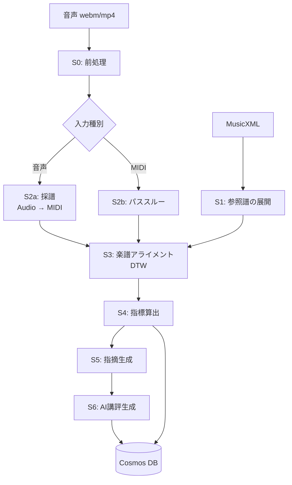

# 分析パイプライン設計 — Ledger Lines

| 項目 | 内容 |
|---|---|
| ドキュメントID | DESIGN-PIPELINE |
| バージョン | 0.1（M3 ドラフト） |
| 最終更新 | 2026-07-25 |
| 検証 | 本書のライブラリ選定・パラメータは M4（分析エンジンPoC）で確定する |

---

## 1. 全体像

音声（またはMIDI）と楽譜を入力に、指標・指摘・AI講評を出力する非同期パイプライン。



| ステージ | 名称 | 目標時間<br/>(3分の演奏) | 失敗時 |
|---|---|---|---|
| S0 | 前処理 | 3秒 | 中断 |
| S1 | 参照譜の展開 | 1秒（曲登録時に事前実行しキャッシュ） | 中断 |
| S2 | 採譜 | 25秒 | 中断 |
| S3 | 楽譜アライメント | 8秒 | 部分結果を返す |
| S4 | 指標算出 | 2秒 | 中断 |
| S5 | 指摘生成 | 1秒 | 空で継続 |
| S6 | AI講評 | 12秒 | 空で継続（後で再試行） |
| | **合計** | **約52秒** | |

**S6 の失敗は致命的でない。** 分析結果自体は S4/S5 で完成しているため、
講評なしで `completed` にし、バックグラウンドで再試行する。

---

## 2. S0: 前処理

### 2.1 処理内容

| # | 処理 | 詳細 |
|---|---|---|
| 1 | デコード | `ffmpeg` で WAV (PCM 16bit) に変換 |
| 2 | リサンプル | 16 kHz モノラル（採譜モデルの入力仕様に合わせる） |
| 3 | DC オフセット除去 | 平均値を減算 |
| 4 | 無音トリム | 先頭・末尾の無音を除去（閾値 -50 dBFS、余白 0.3秒を残す） |
| 5 | 品質チェック | 下表 |

> **注意**: 正規化（ノーマライズ）は**行わない**。ダイナミクス評価のため相対音量を保持する必要がある。
> 音量が小さすぎる場合はエラーにするか、ゲイン係数を記録したうえで適用する。

### 2.2 品質チェック

| チェック | 閾値 | 失敗時 |
|---|---|---|
| 実効音量 | RMS < -45 dBFS | `AUDIO_TOO_QUIET` |
| クリッピング率 | サンプルの 1% 超が \|x\| > 0.99 | 警告（`dynamics` を N/A に） |
| 長さ | < 3秒 または > 15分 | `INVALID_LENGTH` |
| ピアノらしさ | 後述 | `NOT_PIANO` |
| メトロノーム混入 | 後述 | 警告のみ |

**ピアノらしさの判定**: スペクトル重心の時間変化と、
オンセット後の減衰カーブ（ピアノは打鍵後に単調減衰する）から簡易判定する。
軽量な分類器で十分。厳しくしすぎると電子ピアノの音色で誤検知するため、閾値は緩めに。

**メトロノーム混入の判定**: 一定間隔（±10ms）で繰り返す短いブロードバンドのオンセットを検出。
検出時は「メトロノーム音が録音に含まれています。ヘッドホンの使用を推奨します」と警告する。
除去は行わない（除去処理で演奏音まで劣化するリスクのほうが大きい）。

### 2.3 出力

```
preprocessed.wav        16kHz mono PCM
preprocess_meta.json    { rmsDbfs, peakDbfs, clippingRate, durationSec,
                          trimOffsetSec, agcDetected, metronomeDetected }
```

`trimOffsetSec` は重要。以降のすべての時刻はトリム後を基準にするため、
元音声への再生シークには元の時間軸に戻す必要がある。

---

## 3. S1: 参照譜の展開

MusicXML を「演奏順の音符列」に変換する。**曲登録時に一度だけ実行し、結果をキャッシュする。**

### 3.1 使用ライブラリ

| 候補 | 評価 |
|---|---|
| **music21** (MIT, Python) | ◎ 第一候補。繰り返し展開 (`Expander`)、和声解析、拍子・調号の扱いが充実 |
| partitura (Apache-2.0, Python) | ○ 演奏解析向けに設計されており、note array の扱いが軽量。music21 より高速 |
| 自前パーサ | × 繰り返し・オッシアの網羅にコストがかかりすぎる |

**第一候補: music21**（繰り返し展開の堅牢さを優先）。
性能問題が出た場合は partitura への切り替えを検討する。

### 3.2 繰り返しの展開

これが最大の落とし穴（機能仕様の R7）。

| 記号 | 対応 |
|---|---|
| `|: :|` リピート | 展開する |
| 1番/2番括弧 (volta) | 展開する |
| D.C. / D.S. / Coda / Fine | 展開する |
| `segno` / `to coda` | 展開する |

展開後、各音符は以下の2つの小節番号を持つ。

| フィールド | 意味 |
|---|---|
| `measure` | **演奏順**の通し番号（1, 2, ..., N）。分析はこちらを使う |
| `scoreMeasure` | 楽譜上の小節番号。UI表示・楽譜ハイライトはこちらを使う |

繰り返しにより `scoreMeasure` は重複しうる（1回目と2回目）。
UI で楽譜にヒートマップを重ねる際は、**同じ `scoreMeasure` を持つ複数の `measure` のスコアを平均**して表示する。
分析結果の詳細では 1回目/2回目を区別して見られるようにする。

### 3.3 抽出する情報

[指標定義書 1.1節](../spec/metrics.md#11-参照譜-reference-score) の `RefNote` / `RefMeasure` を構築する。

| 情報 | 取得元 |
|---|---|
| 音高・音価・声部・譜表 | `note` 要素 |
| 累積拍 | 拍子と音価から算出 |
| 強弱記号 | `direction/dynamics`。**直前の有効な指示を各音符に伝播させる** |
| ヘアピン | `direction/wedge` の開始・終了から補間 |
| アーティキュレーション | `notations/articulations` |
| スラー | `notations/slur`。開始〜終了の音符に `slurred: true` を付与 |
| ペダル | `direction/pedal` |
| テンポ | `direction/metronome` および `sound[@tempo]` |
| テンポ文字 | `direction/words`（"rit." "rubato" 等を正規表現で抽出） |
| 和音構成 | 同一 onsetBeat の音符群を和音とみなす |

### 3.4 タイの処理

タイで繋がれた音符は**1つの音符に統合**する（onset は最初、duration は合計）。
採譜結果では打鍵は1回しか現れないため、統合しないと `missed` が大量発生する。

### 3.5 出力

```json
{
  "songId": "...",
  "expandedMeasureCount": 96,
  "scoreMeasureCount": 64,
  "notes": [ /* RefNote[] */ ],
  "measures": [ /* RefMeasure[] */ ],
  "hasDynamicMarks": true,
  "hasArticulationMarks": true,
  "hasPedalMarks": false
}
```

`hasXxxMarks` は指標の N/A 判定に使う。

---

## 4. S2a: 採譜（音声 → MIDI）

### 4.1 モデル選定

| 候補 | ライセンス | 特徴 | 評価 |
|---|---|---|---|
| **ByteDance `piano_transcription_inference`** | Apache-2.0 | 高解像度のオンセット/オフセット/velocity 回帰。**sustain pedal 検出を含む**。MAESTRO で学習 | ◎ **第一候補** |
| Spotify Basic Pitch | Apache-2.0 | 軽量・多楽器。CPU で高速 | ○ フォールバック候補。ピアノ特化ではないため精度は劣る |
| hFT-Transformer / 系列モデル | 研究実装 | Transformer ベースで SOTA 級 | △ 実装の成熟度とライセンスを M4 で確認 |
| Google MT3 | Apache-2.0 | マルチトラック。ピアノ単体には過剰 | △ |

**選定理由（ByteDance）**:
1. **velocity を回帰で推定する**（ダイナミクス指標に必須）
2. **sustain pedal を専用のサブネットワークで検出する**（ペダル指標に必須）
3. Apache-2.0 で商用利用可能
4. 実績が豊富で、事前学習済みモデルが公開されている

Basic Pitch は velocity/pedal の情報が弱く、本プロダクトの差別化指標（表現の評価）を支えられない。

### 4.2 性能上の課題と対策

| 課題 | 対策 |
|---|---|
| GPU 前提の実装 | ONNX Runtime へ変換し CPU 推論を試す。M4 で 3分/25秒 を達成できるか検証 |
| 長時間音源のメモリ | 30秒のチャンクに 2秒のオーバーラップを付けて分割推論し、重複区間はオンセット確信度の高い方を採用 |
| 初回のモデルロードが遅い | コンテナイメージにモデルを同梱し、ウォームスタートを維持（最小レプリカ1、ただしコスト次第） |

**CPU 推論が間に合わない場合の代替案**:
- Container Apps の GPU ワークロードプロファイルを使用（コスト増）
- Basic Pitch で高速に一次推論し、velocity/pedal を諦める（品質低下）

→ **M4 の最重要検証項目**。

### 4.3 後処理

| # | 処理 | 目的 |
|---|---|---|
| 1 | 確信度フィルタ | `confidence < 0.2` の音符を除去 |
| 2 | 極短音の除去 | 30ms 未満の音符を除去（スプリアス） |
| 3 | 同音の統合 | 同じ音高で 50ms 以内に連続する検出を統合 |
| 4 | ペダル残響の抑制 | ペダル ON 区間で、直前の音の倍音由来と推定される弱い検出を降格 |

### 4.4 出力

```json
{
  "notes": [ { "id", "onsetSec", "offsetSec", "midi", "velocity", "confidence" } ],
  "pedals": [ { "type": "sustain", "downSec", "upSec", "confidence" } ],
  "modelVersion": "bytedance-pt-v1.0",
  "meanConfidence": 0.83
}
```

`modelVersion` の記録は必須。モデル更新時に過去テイクとの比較可能性を判断するため
（→ [データモデル](./data-model.md) の再解析方針）。

---

## 5. S2b: MIDI 入力のパススルー

MIDI キーボード接続時（Web MIDI API）は採譜をスキップする。

| 処理 | 内容 |
|---|---|
| ノート抽出 | note-on/off から `PerfNote` を構築。`confidence = 1.0` |
| ペダル抽出 | CC64 から `PedalEvent` を構築。閾値 64 |
| velocity | そのまま使用（採譜より遥かに正確） |

MIDI 入力時は全指標の信頼度が高くなるため、UI で「高精度モード」として明示する。

---

## 6. S3: 楽譜アライメント

**パイプライン中で最も難易度が高く、全体の品質を決めるステージ。**

### 6.1 目的

参照譜の音符列と演奏の音符列を対応付け、以下を得る。

1. `Match[]` — matched / missed / extra の判定
2. `BeatMap` — 演奏時刻 ↔ 拍 の相互変換
3. `measureConfidence[]` — 小節ごとのアライメント信頼度

### 6.2 アルゴリズム: 2段階アライメント

単純な DTW では、繰り返しの多い曲や大きなミスがある演奏で破綻する。
以下の2段階構成にする。

#### Stage 1: 粗いアライメント（クロマ DTW）

```
1. 参照譜から合成的なクロマグラム（12次元 × 時間）を生成
   ・ 各時刻で鳴っている音符のピッチクラスを 1 にする
   ・ 仮テンポ（ユーザー指定 or 楽譜の記譜テンポ）で時間軸を作る
2. 採譜結果からも同様にクロマグラムを生成
3. Subsequence DTW（部分列DTW）で対応付ける
   ・ 部分列にするのは「一部の小節だけを録音した」ケースに対応するため
4. 結果から演奏された小節範囲 playedRange を確定
```

**クロマを使う理由**: 音符レベルの対応より、和声の輪郭のほうがミスに頑健。
まず「どこを弾いているか」を確定させる。

**使用ライブラリ**: `librosa`（クロマ生成、`librosa.sequence.dtw`）。BSD-3-Clause。

#### Stage 2: 精密アライメント（音符レベル）

Stage 1 で得た大まかな時間対応を初期値に、音符レベルで対応を取る。

```
1. 参照音符と演奏音符の間でコスト行列を構築
   cost(r, p) = w1 * pitchCost(r, p)
              + w2 * timeCost(r, p)
   pitchCost = 0 (同一) | 0.6 (オクターブ違い) | ∞ (それ以外)
   timeCost  = |t_expected(r) - onsetSec(p)| / tolerance
   ・ t_expected は Stage 1 の時間対応から算出
   ・ tolerance は 0.3秒（Stage 1 の誤差を吸収）
2. Stage 1 のパスから ±2秒 のバンド内に探索を制限（計算量削減）
3. 最小コストマッチングを解く
   ・ 和音（同一 onsetBeat の音符群）は集合として扱い、集合内でハンガリアン法
   ・ 和音間は単調性制約付きの DP
4. 未対応の参照音符 → missed
   未対応の演奏音符 → extra
```

**単調性制約**: 演奏は時間順に進むため、対応も単調でなければならない。
これにより「たまたま音高が合う遠い音符」との誤マッチを防ぐ。

### 6.3 BeatMap の構築

matched 音符のペア `(onsetBeat_ref, onsetSec_perf)` から、単調増加な区分線形写像を作る。

```
1. すべての matched ペアを onsetBeat でソート
2. 外れ値を除去（局所的なテンポから 3σ 以上離れる点）
3. 小節境界ごとにアンカー点を設定
   ・ 各小節の最初の matched 音符を優先
   ・ なければ小節内の matched 音符から線形回帰で推定
4. アンカー点間を線形補間
5. 単調性を強制（前のアンカーより早い点は補正）
```

小節ごとの実測テンポ：

```
T(m) = 小節mの拍数 / ( beatToSec(小節m末) - beatToSec(小節m頭) ) * 60
```

**BeatMap の品質がリズム指標とテンポ指標の両方を決める。**
アンカー点が少ない小節（matched が 2音未満）は信頼度を大きく下げる。

### 6.4 信頼度の算出

```
c_alignment(m) = sigmoid( a * (matchRate(m) - b) ) * anchorQuality(m)

matchRate(m)    = matched数 / 参照音符数
anchorQuality(m) = min(1, matched数 / 3)   … アンカー3点以上で満点
```

### 6.5 失敗判定

| 条件 | 結果 |
|---|---|
| Stage 1 の DTW 正規化コストが閾値超過 | `ALIGN_FAILED` |
| 全体の matchRate < 0.35 | `TOO_MANY_ERRORS` |
| `playedRange` が 2小節未満 | `ALIGN_FAILED` |

失敗時も採譜結果（ピアノロール）と音声は保存し、UI で提示する。

### 6.6 検討した代替案

| 手法 | 不採用の理由 |
|---|---|
| HMM ベースの score following | オンライン向け。オフラインで全体を見られる本件では DTW のほうが精度が出る |
| Nakamura らの symbolic alignment (`AlignmentTool`) | ◎ 精度は高い。**M4 で第2候補として比較評価する**。ライセンスと組み込み容易性を確認 |
| 単一段階の音符レベル DTW | 大きなミスや繰り返しで破綻する |

> **M4 での比較評価対象**: 自前2段階 DTW vs Nakamura の alignment tool。
> 精度が同等なら実装保守性の観点で自前を選ぶ。

---

## 7. S4: 指標算出

[指標定義書](../spec/metrics.md) の定義をそのまま実装する。純粋な数値計算であり、外部依存はない。

### 7.1 実装方針

```python
# 疑似コード
def score_take(ref: ReferenceScore, perf: Performance, align: AlignmentResult) -> TakeScores:
    measures = []
    for m in align.played_range_measures():
        conf = confidence(m, perf, align)
        if conf < 0.5:
            measures.append(MeasureScore(m, score=None, metrics=NA_ALL, confidence=conf))
            continue
        metrics = {
            "pitch":        pitch_score(m, ref, align),
            "rhythm":       rhythm_score(m, ref, perf, align),
            "tempo":        tempo_score(m, ref, align),
            "dynamics":     dynamics_score(m, ref, perf, align) if ref.has_dynamic_marks else NA,
            "articulation": articulation_score(m, ref, perf, align) if ... else NA,
            "pedal":        pedal_score(m, ref, perf, align) if ... else NA,
        }
        measures.append(MeasureScore(m, weighted_mean(metrics), metrics, conf))
    return aggregate(measures, ref)
```

### 7.2 テスト戦略

指標算出は**決定的な純関数**であるため、単体テストで厳密に検証できる。

| テスト | 内容 |
|---|---|
| 完全一致テスト | 参照譜をそのまま演奏として入力 → 全指標 100 点 |
| 単一ミステスト | 1音だけ抜く → `pitch` のみ低下、他は不変 |
| **指標独立性テスト** | 各指標を狙って劣化させ、他指標が動かないことを確認 |
| テンポ一律変更テスト | 全体を 0.8倍速 → `tempo` は満点（基準は実演奏の中央値のため） |
| ルバートテスト | 楽節末で滑らかに遅くする → `tempo` 減点なし |
| 正規化テスト | 全体の音量を半分に → `dynamics` は不変 |

**指標独立性テストが最重要。** 1つのミスで6指標すべてが下がると、原因の切り分けができなくなる。

---

## 8. S5: 指摘生成

[指標定義書 5章](../spec/metrics.md#5-指摘-issue-の生成) のルールに従い、
ルールベースで指摘の種別・位置・重要度・タイトルを生成する。

詳細文（原因と対処法）はこの時点では空にし、S6 で LLM に生成させる。

---

## 9. S6: AI講評生成

[AIプロンプト設計](./ai-prompts.md) を参照。本ステージの入出力のみ記す。

### 9.1 入力

構造化された分析サマリ（トークン節約のため要約済み）＋楽曲メタ情報＋過去テイクの推移。
**信頼度の低い小節は除外する。**

### 9.2 出力

`AiReview` 構造体（headline / summary / strengths / improvements / practiceMenu / context）
＋ 各指摘の詳細文。

### 9.3 失敗時

| 状況 | 対応 |
|---|---|
| LLM API エラー | 最大2回リトライ（指数バックオフ）。それでも失敗ならテイクを `completed` にして講評を空にし、非同期で再試行キューに入れる |
| JSON パース失敗 | 1回だけ「JSONのみを返せ」と再指示。失敗なら上に同じ |
| 出力の検証失敗（→ 9.4） | 1回再生成。失敗なら該当フィールドを落として保存 |

### 9.4 出力の自動検証

ハルシネーション対策（機能仕様の R4）として、生成結果を機械的に検証する。

| 検証 | 内容 |
|---|---|
| 小節番号の実在 | 言及された小節がすべて `playedRange` 内か |
| 信頼度 | 言及された小節の `confidence ≥ 0.7` か |
| 数値の整合 | 講評中の数値（スコア・BPM）が入力データと一致するか |
| 練習テンポ | `practiceMenu` の BPM が目標テンポの 40-110% の範囲か |
| 合計時間 | `practiceMenu` の合計が設定時間の ±20% に収まるか |

検証に失敗した項目は削除するか、再生成する。

---

## 10. 実行基盤

### 10.1 ジョブ構成

```
API (Next.js)
  └─ テイク作成 → Azure Storage Queue にメッセージ投入
       └─ Analysis Worker (Container Apps Job / KEDA スケール)
            └─ S0 → S6 を単一プロセスで逐次実行
                 └─ 各ステージ完了時に Cosmos DB の status を更新
```

**単一プロセスで逐次実行する理由**: ステージ間で受け渡すデータ（音声、採譜結果）が大きく、
ステージごとにジョブを分けると Blob 経由の往復でオーバーヘッドが増える。
3分の演奏で 50秒程度なら、1ジョブで完結させるほうが単純かつ高速。

### 10.2 冪等性

同一テイクIDでジョブが重複実行されても安全にする。

- Cosmos DB への書き込みは upsert
- 中間成果物の Blob パスはテイクIDで決定的
- 既に `completed` のテイクはジョブ開始時にスキップ

### 10.3 リトライ

| 失敗種別 | リトライ |
|---|---|
| 一時的（ネットワーク、スロットリング） | 最大2回、指数バックオフ |
| 恒久的（`AUDIO_TOO_QUIET` 等） | リトライしない。`failed` にして理由を保存 |
| ワーカーのクラッシュ | キューの可視性タイムアウト経過後に自動再配信（最大3回、超過で dead-letter） |

### 10.4 中間成果物の保存

| 成果物 | 保存先 | 保持期間 |
|---|---|---|
| 元音声 | Blob `audio/{userId}/{takeId}/original.webm` | 無期限（ユーザー削除まで） |
| 前処理済み音声 | Blob `work/{takeId}/preprocessed.wav` | 7日（デバッグ用）→ 自動削除 |
| 採譜結果 (MIDI/JSON) | Blob `derived/{takeId}/transcription.json` | 無期限 |
| アライメント結果 | Blob `derived/{takeId}/alignment.json` | 無期限 |
| 指標・指摘・講評 | Cosmos DB | 無期限 |

**採譜結果とアライメント結果を保存する理由**:
指標の定義を改訂したとき、採譜をやり直さずに再スコアリングできる。
採譜が最も重い処理であるため、これは大きな節約になる。

### 10.5 再解析

| 再解析の種類 | 実行内容 | 契機 |
|---|---|---|
| 再スコアリング | S4 以降のみ | 指標定義の改訂 |
| 再アライメント | S3 以降 | アライメント改善 |
| フル再解析 | S0 以降 | 採譜モデルの更新 |

過去テイクを一括再解析すると、ユーザーから見て「スコアが勝手に変わる」。
これは成長の可視化という価値を毀損するため、以下の方針を取る。

- 再解析は**曲単位で全テイクをまとめて**実行する（相対比較の一貫性を保つ）
- ユーザーに「分析エンジンを改善したため、過去の記録を再計算しました」と通知する
- `analysisVersion` をテイクに記録し、異なるバージョン間の比較には注意表示を出す

---

## 11. 開発・検証環境

### 11.1 オフライン評価ハーネス

M4 以降、パイプラインの品質を継続的に測るための仕組みを用意する。

```
eval/
├── datasets/
│   ├── a-midi-audio-pairs/     # グランドトゥルースあり
│   ├── b-injected-errors/      # 意図的ミス
│   ├── c-real-practice/        # 実練習録音
│   └── d-expert/               # 上級者演奏
├── run_eval.py                 # 全データセットを流して指標を出力
└── reports/                    # 実行ごとのレポート
```

出力する評価指標：

| カテゴリ | 指標 |
|---|---|
| 採譜 | note F1、onset MAE、velocity 相関、pedal F1 |
| アライメント | 対応正解率、BeatMap の時刻誤差 |
| スコア | 講師評価との Spearman ρ、ワースト5一致率 |
| 講評 | 自動検証（9.4）の通過率 |
| 性能 | 各ステージの実行時間（p50/p95） |

**CI で毎回実行するには重すぎる**ため、
小規模なサブセット（各10件）を CI で、フルセットを週次で実行する。

---

## 12. 関連ドキュメント

- [評価指標定義](../spec/metrics.md)
- [AIプロンプト設計](./ai-prompts.md)
- [データモデル](./data-model.md)
- [Azureアーキテクチャ](./architecture.md)
