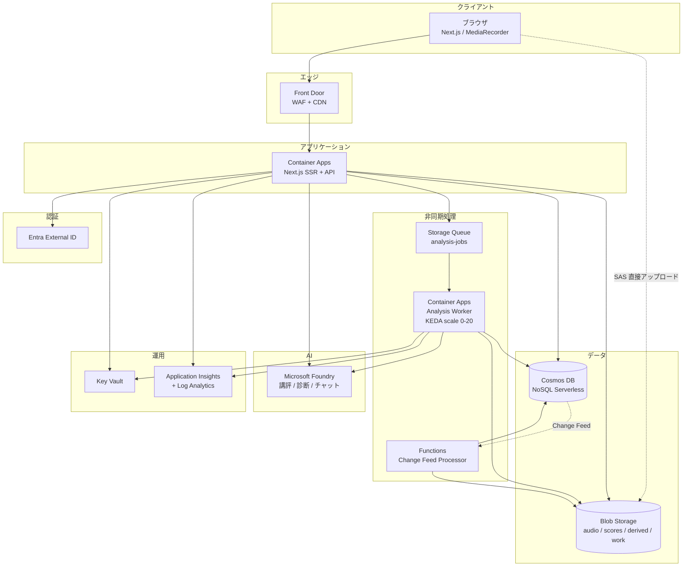
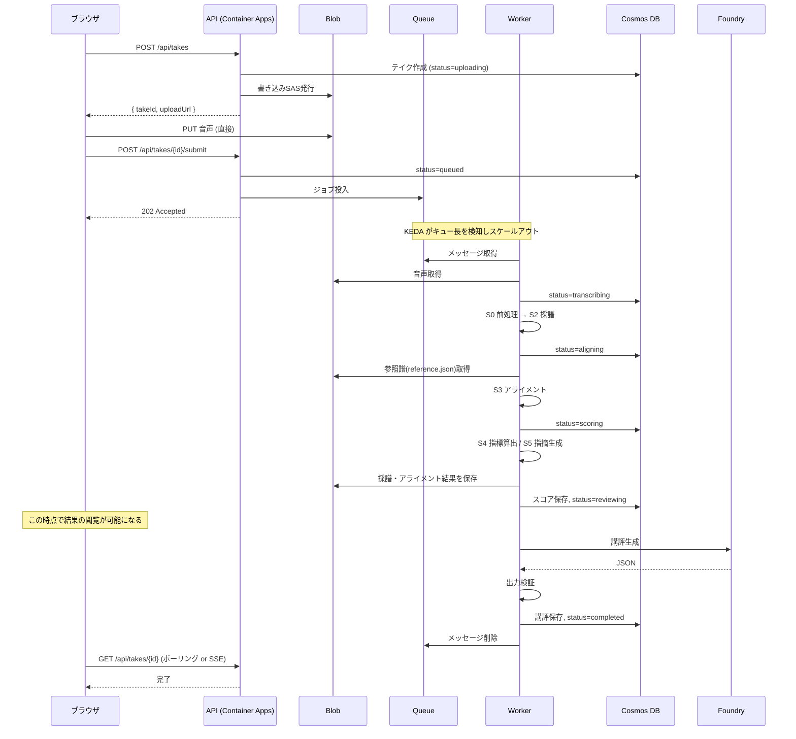

# Azureアーキテクチャ設計 — Ledger Lines

| 項目 | 内容 |
|---|---|
| ドキュメントID | DESIGN-ARCH |
| バージョン | 0.1（M3 ドラフト） |
| 最終更新 | 2026-07-25 |
| 規模想定 | MVP: 1,000 MAU / 20,000 テイク・月 |

---

## 1. 全体構成



---

## 2. コンポーネント選定

### 2.1 サービス一覧

| # | 役割 | サービス | SKU / 構成 |
|---|---|---|---|
| 1 | Web + API | Azure Container Apps | Consumption。min 1 / max 10 |
| 2 | 解析ワーカー | Azure Container Apps Job（イベント駆動） | Consumption。**min 0** / max 20 |
| 3 | ジョブキュー | Azure Storage Queue | Standard LRS |
| 4 | オブジェクトストレージ | Azure Blob Storage | Standard LRS、Hot/Cool 階層化 |
| 5 | データベース | Azure Cosmos DB for NoSQL | **Serverless** |
| 6 | 生成AI | Microsoft Foundry | 標準デプロイ |
| 7 | 認証 | Microsoft Entra External ID | — |
| 8 | シークレット | Azure Key Vault | Standard |
| 9 | 監視 | Application Insights + Log Analytics | 従量課金 |
| 10 | エッジ | Azure Front Door | Standard |
| 11 | 非正規化更新 | Azure Functions（Cosmos DB トリガー） | Consumption |
| 12 | コンテナレジストリ | Azure Container Registry | Basic |
| 13 | 教室招待メール | Azure Communication Services Email | 専用 sender Managed Identity、ACS resource scope RBAC、Azure-managed / 検証済み domain |

### 2.2 主要な選定理由

#### Container Apps を選ぶ理由（vs App Service / AKS）

| 観点 | 判断 |
|---|---|
| **ゼロスケール** | 解析ワーカーは負荷が断続的。App Service では常時課金になる。Container Apps は 0 まで落とせる |
| **KEDA によるキュー駆動スケール** | キュー長に応じた自動スケールが標準機能。自前実装が不要 |
| **運用負荷** | AKS はノード管理・アップグレードの負荷が MVP には過大 |
| **Python ワーカーとの相性** | 採譜には特殊な依存（PyTorch, ffmpeg, librosa）が必要。コンテナが前提になる |
| **GPU への移行パス** | 必要になれば GPU ワークロードプロファイルへ移行できる |

> **Next.js を Container Apps に載せる理由**: ワーカーと同じ基盤に統一して運用を単純化する。
> Static Web Apps + Functions の構成も検討したが、SSR とストリーミング（チャット）の
> 制御を考えると Container Apps のほうが素直。

#### Cosmos DB Serverless を選ぶ理由

- MVP の負荷（月20,000テイク ≒ 約 200万 RU）ではプロビジョニング済みスループットより安価
- **上限は 5,000 RU/s、20GB/パーティション**。この範囲を超える見込みが立った時点で自動スケールへ移行
- パーティション設計は移行時に変えないで済むよう [データモデル](./data-model.md) で先に確定済み

#### Storage Queue を選ぶ理由（vs Service Bus）

| 観点 | 判断 |
|---|---|
| 必要な機能 | FIFO 厳密順序・トピック・セッションは不要。単純なワークキューで足りる |
| コスト | Storage Queue のほうが大幅に安い |
| KEDA 対応 | 両方対応。差はない |
| メッセージサイズ | 64KB で十分（Blob パスとIDのみを載せる） |

将来、通知やイベント駆動の連携が増えたら Service Bus を追加する。

---

## 3. 処理フロー

### 3.1 録音から分析完了まで



**重要な設計判断**: `status=reviewing` の時点でスコアは確定しており、
UI は分析結果を表示できる。**AI講評の生成完了を待たせない。**
講評は完成し次第、差し込む。

### 3.2 進捗の伝達

| 方式 | 採用 |
|---|---|
| **SSE (Server-Sent Events)** | ◎ 採用。Container Apps でストリーミング可。実装が単純 |
| WebSocket | △ 双方向は不要 |
| ポーリング | ○ SSE のフォールバックとして残す（3秒間隔） |

API `GET /api/takes/{id}/events` が SSE で status の変化を push する。
サーバー側は Cosmos の Change Feed ではなく、単純に定期読み取り（1秒）して差分を送る
（テイク単位のポイントリードは 3 RU 程度と安価）。

---

## 4. スケーリング

### 4.1 解析ワーカー

```yaml
scale:
  minReplicas: 0
  maxReplicas: 20
  rules:
    - name: queue-length
      azureQueue:
        queueName: analysis-jobs
        queueLength: 1        # 1メッセージにつき1レプリカ
        accountName: ...
        identity: system
```

| パラメータ | 値 | 理由 |
|---|---|---|
| `minReplicas` | 0 | コスト最優先。夜間・早朝は完全に停止 |
| `queueLength` | 1 | 1ジョブ = 1レプリカ。並列度を上げてレイテンシを最小化 |
| `maxReplicas` | 20 | コスト上限の制御。超過分はキューで待つ |

**コールドスタート問題**: `minReplicas: 0` だとコンテナ起動 + モデルロードで 20-40秒かかる。

> **M4 を受けた再評価**: 解析そのものが 3分の曲で 4.3分（M4.5 の ONNX 化後は **約2.5分**）
> かかることが判明したため、
> コールドスタートの 20-40秒は**相対的な重要度が下がった**（全体の 20% 未満）。
> それでも待機時間の総量には効くので、下記の対策は維持する。
> ただし **B（日中 minReplicas: 1）の優先度は下げてよい**。

対策：

| 案 | 内容 | 判断 |
|---|---|---|
| A | モデルをコンテナイメージに同梱し、起動時ロードを最小化 | **採用**（必須） |
| B | `minReplicas: 1` で常時1レプリカ待機 | **採用**（日中のみ）。夜間はスケジュールで 0 に |
| C | イメージサイズを削減（PyTorch → ONNX Runtime） | **採用**。イメージ 4GB → 1.2GB を目標 |
| D | Container Apps の起動プローブを最適化 | 採用 |

> 日中（8:00-24:00 JST）は `minReplicas: 1`、深夜は 0 にする。
> 常時1レプリカの追加コストは月 3,000円程度で、体験の改善に見合う。

### 4.2 Web/API

```yaml
scale:
  minReplicas: 1
  maxReplicas: 10
  rules:
    - name: http
      http:
        metadata:
          concurrentRequests: "50"
```

### 4.3 リソース割り当て

| コンポーネント | CPU | メモリ | 根拠 |
|---|---|---|---|
| Web/API | 0.5 | 1 GiB | SSR 中心。重い処理はしない |
| Analysis Worker | **4** | **8 GiB** | 採譜モデルの推論。M4 で実測して確定 |

Container Apps Consumption の上限は 4 vCPU / 8 GiB。
これで足りない場合は Dedicated ワークロードプロファイルへ移行する。

> **M4 の実測: 4 vCPU で据え置く。増やしても速くならない。**
>
> | スレッド数 | RTF（音声長に対する処理時間の比） |
> |---|---|
> | 12 | 1.15 |
> | 4 | 1.25 |
>
> スレッド数を 3 倍にしても 8% しか改善しない。ByteDance の採譜モデルの CPU 推論は
> **メモリ帯域律速**であり、コア数を増やす投資は無意味である。
> 4 vCPU で RTF ≒ 1.25、すなわち **3分の曲に 3.75 分**かかる。
> → [m4-report.md 2.3](../poc/m4-report.md#23-速度)
>
> **M4.5: ONNX Runtime fp32 に移行して RTF 0.63（約2倍速）。出力はビット一致。**
> int8 動的量子化は Conv 主体のモデルでは逆効果（最大9倍遅い）だったため採用しない。
> さらなる高速化が必要になった場合の選択肢は、静的量子化、無音区間のスキップ、
> または GPU（NC 系）への移行である。
> → [m45-report.md 2章](../poc/m45-report.md#2-onnx-化による採譜の高速化)

---

## 5. セキュリティ

### 5.1 認証・認可

| 対象 | 方式 |
|---|---|
| ユーザー | Microsoft Entra External ID（OIDC）。ソーシャルログイン（Google/Apple）＋メール |
| API | Bearer トークン検証。ミドルウェアで全ルートを保護 |
| 共有ビュー `/s/{token}` | 認証不要。トークンを Cosmos で検証し、有効期限・無効化を確認 |
| サービス間 | **マネージドID**。接続文字列やキーは使わない |

### 5.2 マネージドIDの権限

| From | To | ロール |
|---|---|---|
| Web/API | Cosmos DB | Cosmos DB Built-in Data Contributor |
| Web/API | Blob | Storage Blob Data Contributor |
| Web/API | Queue | Storage Queue Data Sender |
| Web/API | Foundry | Cognitive Services User |
| Web/API | Key Vault | Key Vault Secrets User |
| Worker | Cosmos DB | Cosmos DB Built-in Data Contributor |
| Worker | Blob | Storage Blob Data Contributor |
| Worker | Queue | Storage Queue Data Message Processor |
| Worker | Foundry | Cognitive Services User |
| Functions | Cosmos DB | Cosmos DB Built-in Data Contributor |
| Functions | Blob | Storage Blob Data Contributor |

> **原則: 最小権限。** 特に Worker は Queue の「送信」権限を持たせない。

### 5.3 ネットワーク

| フェーズ | 構成 |
|---|---|
| MVP | パブリックエンドポイント + Front Door WAF。Cosmos/Blob はファイアウォールで Container Apps の送信IPに限定 |
| Phase 2 | VNet 統合 + Private Endpoint（Cosmos, Blob, Key Vault, Foundry） |

MVP で VNet を入れない理由：構成の複雑さとコスト（Private Endpoint × 4 で月約 5,000円）に対し、
マネージドID + ファイアウォールで実用上十分なリスク低減が得られるため。
ただし**エンタープライズ展開時には必須**なので、実装済みの IaC モジュールへ
Private Endpoint と VNet 統合を追加できるようにしておく。

### 5.4 データ保護

| 項目 | 対応 |
|---|---|
| 転送時 | TLS 1.2 以上を強制 |
| 保管時 | Azure 既定の暗号化（Microsoft管理キー）。将来 CMK に対応可能な構成にする |
| Blob アクセス | パブリックアクセス無効。SAS のみ（読み15分 / 書き30分） |
| 音声の学習利用 | 既定オフ。ユーザーが明示同意した場合のみ |
| Foundry | 入力を学習に使わない設定。ログ保持のオプトアウトを申請 |

### 5.5 共有リンクのセキュリティ

| 対策 | 内容 |
|---|---|
| トークン | 32バイトの暗号論的乱数（base64url、43文字） |
| 有効期限 | 既定90日。Cosmos の TTL で自動削除 |
| 無効化 | `enabled: false` で即座に失効 |
| 音声再生 | 共有ビューでも SAS 経由。トークン検証後に短命 SAS を発行 |
| インデックス回避 | `X-Robots-Tag: noindex` を返す |
| レート制限 | 同一トークンへの過剰アクセスを Front Door で制限 |

---

## 6. 可観測性

### 6.1 メトリクス

| カテゴリ | 指標 |
|---|---|
| 業務 | テイク投入数、解析成功率、失敗理由の内訳、平均スコア |
| 性能 | ステージ別処理時間（p50/p95/p99）、キュー待ち時間、E2E 時間 |
| AI | LLM 呼び出し数、トークン数、検証違反率、再生成率 |
| インフラ | レプリカ数、CPU/メモリ使用率、Cosmos RU 消費、Blob 容量 |
| コスト | サービス別の日次コスト |

### 6.2 分散トレース

Application Insights の相関IDを、`takeId` をキーにして全ステージで引き継ぐ。

```
traceId = takeId
├─ span: upload
├─ span: queue-wait
├─ span: s0-preprocess
├─ span: s2-transcribe        ← 最も重い。個別に監視
├─ span: s3-align
├─ span: s4-score
└─ span: s6-review
     └─ span: llm-call
```

**1テイクの処理を1つのトレースで追える**ことが、性能問題の切り分けに必須。

### 6.3 アラート

| # | 条件 | 深刻度 |
|---|---|---|
| A1 | 解析失敗率 > 10%（15分平均） | 高 |
| A2 | E2E 時間 p95 > 180秒 | 高 |
| A3 | キュー長 > 100 が10分継続 | 中 |
| A4 | LLM 検証違反率 > 20% | 中 |
| A5 | Cosmos の 429（スロットリング）発生 | 中 |
| A6 | 日次コストが予算の 120% | 中 |
| A7 | dead-letter キューにメッセージ | 中 |

### 6.4 ログ

| ログ | 内容 | 保持 |
|---|---|---|
| アプリケーションログ | 構造化ログ（JSON）。`takeId`, `userId`, `stage` を必ず含む | 30日 |
| 監査ログ | 共有リンクの発行・アクセス、データ削除 | 1年 |
| LLM ログ | プロンプトバージョン、トークン数、検証結果。**プロンプト本文とレスポンスは保存しない**（プライバシー） | 90日 |

> **LLM の入出力を保存しない**のは、演奏内容が個人情報に準じるため。
> 品質問題の調査には、ユーザーが明示的に「この講評を報告する」操作をしたときだけ保存する。

---

## 7. コスト試算

### 7.1 前提

| 項目 | 値 |
|---|---|
| MAU | 1,000 |
| テイク数 | 20,000 / 月 |
| 平均録音長 | 3分 |
| 平均音声サイズ | 3 MB（Opus 128kbps） |
| 解析時間 | **平均 145秒**（4 vCPU / 8 GiB、M4.5 実測 RTF 0.63 に基づく） |
| LLM トークン | 2,900 / テイク |

> **M4 で解析時間の前提が 55秒 → 260秒 に修正された（4.7倍）。**
> 当初は採譜が実時間の 1/3 程度で終わると見積もっていたが、
> PyTorch 実測では実時間の 1.25 倍かかった。**この差はコスト試算を直撃した。**
>
> **M4.5 で ONNX Runtime 化により RTF 1.25 → 0.63 となり、260秒 → 145秒 に戻した。**
> ただし RTF の絶対値は測定マシンの負荷でぶれるため、本番インスタンスでの再測定が要る。

### 7.2 内訳（月額、円。1 USD = 155円換算の概算）

| # | サービス | 算出根拠 | 月額 |
|---|---|---|---|
| 1 | Container Apps（Worker） | 20,000件 × 145秒 = 806 vCPU時間 × 4vCPU/8GiB相当<br/>+ 日中 minReplicas:1 の待機分 | **61,300** |
| 2 | Container Apps（Web/API） | 1レプリカ常時 + スパイク | 6,000 |
| 3 | **Microsoft Foundry** | 5,800万トークン（入出力混在） | **32,000** |
| 4 | Cosmos DB Serverless | 約 300万 RU + 5 GB | 5,000 |
| 5 | Blob Storage | 音声 60GB/月 累積（Hot→Cool）+ derived 20GB | 4,000 |
| 6 | Front Door Standard | 基本料 + 転送 | 5,500 |
| 7 | Application Insights | 取り込み 10GB | 3,500 |
| 8 | Storage Queue / ACR / Key Vault | — | 1,500 |
| 9 | Entra External ID | 50,000 MAU まで無料枠 | 0 |
| | **合計** | | **約 118,800** |

> **目標の10万円をまだ超過する。** M4 以前の試算（85,500円）は
> 採譜速度の楽観的な前提に依存していた。M4 実測で 161,500円 まで膨らんだが、
> M4.5 の ONNX 化で **118,800円** まで戻した。
> それでもコストの **51% が採譜の CPU 推論**であり、依然として最大項目である。

#### 7.2.1 目標に戻すための施策

| 施策 | 削減見込み | 前提 |
|---|---|---|
| **無料枠を月5テイクに制限**（実装済み） | テイク数が 20,000 → 12,000 程度に | 有料転換率次第 |
| **平均録音長を 3分 → 1.5分と見直す** | -50% | 練習は部分練習が主。録音UIに小節範囲指定がある（[機能仕様](../spec/functional.md)）ため、通し録音は一部にとどまる想定 |
| ~~ONNX Runtime 化~~ | ~~-30〜50%~~ | **M4.5 で実施済み。約2倍速・精度劣化なし。上の試算に反映済み** |
| 無音区間のスキップ | -5〜10% | 録音の前後の空白を切り落とす |

残る2施策（無料枠の制限、平均録音長の見直し）が効けば worker は 61,300 → **20,000〜30,000 円**に収まり、
合計は 8万円前後となる。ただし**この2つは未検証**であり、M5 の早い段階で確かめる必要がある。

> **教訓**: 「1件あたりの処理時間」は数分の測定で確定できるにもかかわらず、
> 設計段階では推測のまま置かれていた。コストの支配項になる変数は最優先で実測すべきである。

### 7.3 コスト上位2つの削減余地

#### ① Foundry（32,000円 / 20%）

| 施策 | 削減見込み |
|---|---|
| 講評を中位モデルに変更し、品質を評価セットで確認 | -50% |
| コンテキストJSONの圧縮（冗長なフィールド削除） | -10% |
| 停滞診断のレート制限（7日に1回） | 既に織り込み済み |
| 「変化が小さいテイク」は講評を簡略化（短い出力） | -15% |

> **注意**: ここを削りすぎると差別化の核（AI Coach）が弱くなる。
> 品質評価（[AIプロンプト設計 7章](./ai-prompts.md#7-評価)）で下限を守る。

#### ② Analysis Worker（61,300円 / 52%）

**ここが最大のコスト項目**。7.2.1 の施策を優先度順に実施する。

| 施策 | 削減見込み | 状態 |
|---|---|---|
| ~~ONNX Runtime 化による推論高速化~~ | ~~-30〜50%~~ | **M4.5 で完了（約2倍速）。int8 量子化は逆効果のため不採用** |
| 平均録音長の前提見直し（3分 → 1.5分） | -50% | 実利用データで確認 |
| 無音区間のスキップ | -5〜10% | 実装容易 |
| 音声の 16kHz モノラル化（既に織り込み済み） | — | 完了 |
| 深夜の minReplicas を 0 に | 既に織り込み済み | 完了 |
| チャンク分割の並列化 | **0%**（M4 でスレッド増の効果がないことを実測） | 却下 |

### 7.4 スケール時の見通し

M4 実測ベース（施策未適用）の場合。

| MAU | テイク/月 | 月額概算 | 1ユーザーあたり |
|---|---|---|---|
| 1,000 | 20,000 | 161,000 | 161円 |
| 10,000 | 200,000 | 1,430,000 | 143円 |
| 50,000 | 1,000,000 | 6,900,000 | 138円 |

固定費（Front Door、常時レプリカ）が薄まるため単価は逓減するが、
**変動費（採譜 + LLM）の比率が高いため逓減幅は小さい**。

**課金設計への示唆**: 変動費が1ユーザーあたり月 **138-161円**（施策適用後でも 70-90円程度）かかるため、
完全無料のフリーミアムは成立しない。**無料枠は月5テイクまで**とし、
有料プランは月 500円以上を想定する必要がある。

### 7.5 コスト管理

| 対策 | 内容 |
|---|---|
| 予算アラート | サブスクリプションに予算を設定し、80%/100%/120% で通知 |
| タグ付け | `env`, `component`, `costCenter` を全リソースに付与 |
| 日次モニタリング | Cost Management のエクスポートを Log Analytics に取り込み、A6 アラートに使う |
| ユーザー単位のクォータ | 月間テイク数の上限をプランごとに設定し、暴走を防ぐ |

---

## 8. 環境構成

| 環境 | 用途 | 構成 |
|---|---|---|
| `dev` | 開発 | 最小構成。Cosmos は Emulator またはサーバーレス最小 |
| `stg` | 検証 | 本番同等構成、規模は 1/10 |
| `prod` | 本番 | 本書の構成 |

各環境は**別リソースグループ**、可能なら**別サブスクリプション**に分ける。

### 8.1 IaC（実装済み）

| 項目 | 選択 |
|---|---|
| ツール | **Bicep**（Azure ネイティブ、学習コストが低い） |
| デプロイ | Azure Developer CLI (`azd`) |
| 構成 | `infra/main.bicep` + `infra/modules/` + 環境ごとの `main.parameters.{env}.json` |

```
infra/
├── main.bicep
├── modules/
│   ├── cosmos.bicep
│   ├── storage.bicep
│   ├── foundry.bicep
│   ├── monitoring.bicep
│   ├── key-vault.bicep
│   ├── identity.bicep
│   └── rbac.bicep
├── main.parameters.dev.json
├── main.parameters.stg.json
└── main.parameters.prod.json
```

リソースグループスコープの Bicep と `azure.yaml` は実装済みです。各環境の
Storage / Cosmos Serverless / 監視 / Key Vault / Managed Identity / RBAC を
`azd provision` と `az deployment group what-if` で継続管理できます。Foundry の
モデルデプロイはリージョンの提供状況を確認してから任意に有効化します。
Next.js アプリと解析ワーカーのコンテナイメージは未作成のため、Container Apps の
ホスティングとイメージデプロイはこの IaC のスコープ外です。手順は
`docs/operations/azure-iac.md` を参照してください。

### 8.2 CI/CD

```
GitHub Actions
├── pr.yml          … lint / typecheck / unit test / bicep what-if
├── deploy-stg.yml  … main へのマージで stg にデプロイ → E2E テスト
└── deploy-prod.yml … タグ作成で prod にデプロイ（手動承認あり）
```

| 項目 | 方式 |
|---|---|
| 認証 | OIDC フェデレーション（シークレットを GitHub に置かない） |
| コンテナイメージ | ACR にプッシュ。タグは Git SHA |
| デプロイ戦略 | Container Apps のリビジョン機能で**段階的ロールアウト**（新リビジョンに 10% → 100%） |
| ロールバック | 前リビジョンへのトラフィック切り替え |

---

## 9. 可用性とDR

### 9.1 MVP の方針

| 項目 | 方針 |
|---|---|
| リージョン | Japan East 単一 |
| Cosmos | ローカル冗長。**定期バックアップ（既定8時間ごと、30日保持）** |
| Blob | LRS。誤削除対策として**論理削除（30日）とバージョニングを有効化** |
| 目標復旧時点 (RPO) | 8時間 |
| 目標復旧時間 (RTO) | 24時間 |

**単一リージョンにする理由**: MVP の稼働率目標は 99.5%（月間ダウンタイム 3.6時間）であり、
単一リージョンでも達成可能。マルチリージョンはコストが約1.8倍になる。

### 9.2 Phase 2 以降

| 項目 | 対応 |
|---|---|
| Cosmos | Japan West への読み取りレプリカ追加、可用性ゾーン有効化 |
| Blob | ZRS または GRS |
| Container Apps | 可用性ゾーン対応の環境 |
| Front Door | 複数オリジンへのフェイルオーバー |

### 9.3 データ損失の防止

**最も守るべきは録音音声**。分析結果は再計算できるが、演奏は取り返せない。

| 対策 | 内容 |
|---|---|
| 論理削除 | Blob の soft delete を 30日で有効化 |
| バージョニング | 上書き事故に備える |
| 削除の遅延 | ユーザーの削除操作から30日後に物理削除 |
| 定期検証 | 月次でバックアップからの復元テストを実施 |

---

## 10. 移行・拡張のポイント

| 契機 | 対応 |
|---|---|
| Cosmos Serverless の上限（5,000 RU/s）に到達 | 自動スケールのプロビジョニング済みスループットへ移行。パーティション設計は変更不要 |
| CPU 推論が性能要件を満たさない | Container Apps の GPU ワークロードプロファイルへ。コストは約2.5倍 |
| 集計・分析クエリの需要 | Cosmos Change Feed → Azure Data Explorer へのパイプラインを追加 |
| エンタープライズ／教室向け展開 | VNet + Private Endpoint、Entra ID（従業員テナント）連携、SSO |
| 海外展開 | Front Door のマルチリージョンオリジン、リージョン別データ保存 |

---

## 11. 未決事項

| # | 論点 | 状態 |
|---|---|---|
| Q1 | 採譜を CPU で実行できるか（GPU 要否） | **可（M4 で実証）**。M4.5 の ONNX 化で 4 vCPU で RTF 0.63。解析は 3分の曲で約 2.5分かかるため**非同期前提**は維持。コストは 7.2 のとおり引き続き要削減 |
| Q2 | 講評に使うモデルのグレード | 未決。品質評価が未実施 |
| Q3 | フリーミアムの無料枠（月何テイクまで） | ビジネス判断。7.4 の単価（138-161円/月）を根拠に。**月5テイクは必須** |
| Q4 | Next.js を Container Apps か Vercel か | MVP は Container Apps。運用実績を見て再検討 |
| Q5 | 音声の長期保存コスト（ユーザーが増え続ける） | 1年後に Archive 層への移行ポリシーを検討 |
| Q6 | ~~ONNX / int8 量子化で採譜を高速化できるか~~ | **解決（M4.5）**。ONNX fp32 で約2倍速・出力ビット一致。int8 は Conv 主体のため逆効果で不採用 → [m45-report.md 2章](../poc/m45-report.md#2-onnx-化による採譜の高速化) |
| Q7 | ~~弾き直し・途中停止を含む演奏をアライメントできるか~~ | **解決（M4.5）**。DTW に跳躍遷移を追加。最悪ケース F1 0.400 → 0.959、通常演奏の劣化は −0.004 以内 → [m45-report.md 1章](../poc/m45-report.md#1-弾き直し途中停止へのアライメント対応) |
| Q8 | **同一環境で繰り返し録音したときの差分の安定性** | **測定済み（M4.5）**。総合スコアの測定ノイズ σ ≒ 2.2〜3.0、最小検出差 6〜8点。UI で信頼区間と「横ばい」判定を出す必要がある |
| Q9 | 実録音での弾き直しアライメント精度 | M4.5 の検証は合成データ。ベータで実録音を収集して再評価する |

---

## 12. 関連ドキュメント

- [機能仕様](../spec/functional.md)
- [API仕様](../spec/api.md)
- [データモデル](./data-model.md)
- [分析パイプライン設計](./analysis-pipeline.md)
- [AIプロンプト設計](./ai-prompts.md)
